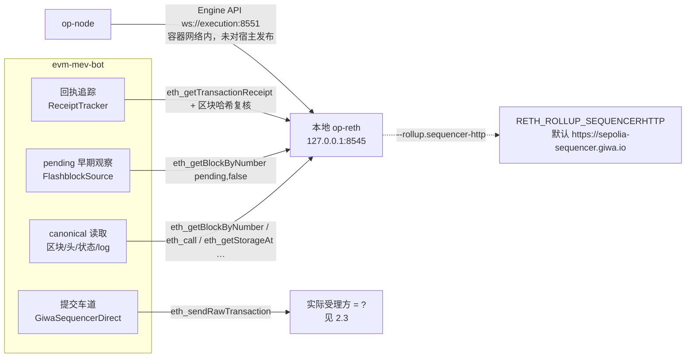

# M12-C GIWA 单节点部署与验证方案

里程碑：M12-C（单节点部署与验证方案编写，文档交付）
任务书：`docs/v0.1/M12C Coding.md`（§1–§8）
前置：`docs/v0.1/M12-A Repo Audit.md` + `data/evidence/m12/audit_manifest.json`；`docs/v0.1/M12-B Completion Report.md` + `data/evidence/m12/b/`
仓库基线：`https://github.com/fenglufa/evm-mev-bot`，`main` = `d34129d07be96d05d0ca58dc2f2d829b9e1d30a9`（= `origin/main`），工作区干净（仅本文档的任务书 `docs/v0.1/M12C Coding.md` 未跟踪）
取证日期：2026-10-10
判定：`M12_C_PLAN = COMPLETE`、`SELF_HOSTED_NODE = NOT_RUN`、`LOCAL_CANONICAL_RPC = NOT_VERIFIED`、`LOCAL_FLASHBLOCKS = NOT_VERIFIED`、`MULTI_NODE_HA = OUT_OF_SCOPE`

---

## 一页结论（白话版，先看这一段）

1. **本轮没有部署任何节点，没有同步任何数据，没有探测任何真实 RPC。** 这一份是"未来怎么部署、怎么验收"的操作手册，不是部署结果。所有 `PASS` 字样的位置都在"验收标准"里，不在"验收结果"里。

2. **最容易踩的坑不是"连不上本地节点"，而是"以为提交也走了本地节点"。**
   读区块、读状态、读 pending：这些确实可以指向 `127.0.0.1:8545`。
   但机器人发交易用的是同一个 `--rpc-url`（`crates/pipeline/src/runner.rs:1325` 把执行车道连到 `config.rpc_url`），
   而官方节点的 `.env.sepolia:12` 把 `RETH_ROLLUP_SEQUENCERHTTP` 默认设成 **公共 sequencer** `https://sepolia-sequencer.giwa.io`。
   也就是说：把机器人指向本地节点，**读**是本地的，**提交路径是否本地**取决于节点自己的 sequencer 配置，而本地节点能不能接受 `eth_sendRawTransaction` 从未验证过。

3. **Flashblocks 在官方配置里默认是关的，而且"怎么开"这件事官方两份文件自相矛盾。**
   `.env.sepolia:15` 是被注释掉的 `#FLASHBLOCKS_WEBSOCKET_URL=wss://sepolia-flashblocks.giwa.io/ws`；
   README 第 81–87 行教用户"uncomment `FLASHBLOCKS_WEBSOCKET_URL=`"（**空值**）；
   而 `reth/entrypoint.sh:23` 的判断是 `[[ -n "${FLASHBLOCKS_WEBSOCKET_URL:-}" ]]` —— **空值等于不开**，会打印 `Running in vanilla mode`。
   结论：照 README 那行抄会静默不开 Flashblocks；正确做法是取消注释 `.env.sepolia` 里那行带值的。本轮只读码得出，未跑节点验证。

4. **机器人现在这条 Flashblocks 车道根本不吃 WS 上游，它只会 HTTP 轮询 `pending`。**
   `--flashblocks-url` 在 runner 里是 `HttpChainAdapter::connect` + `FlashblockSource`（`crates/pipeline/src/runner.rs:1385`），发的是 `eth_getBlockByNumber(["pending", false])`。
   M9.4 那套 WS preconf 雷达（`crates/live/src/preconf_*.rs`）代码齐备、单测齐备，但**从未被 runner 或 CLI 构造**。
   所以"本地节点开了 Flashblocks"和"机器人能用上本地 Flashblocks"是两件不同的事，中间还缺一次接线工作。

5. **官方仓库在动，且动的是关键文件。** tag `v0.6.0`（2026-07-07）与 `main`（`00985a5d…`，2026-07-13）之间，本次比对的 11 个节点仓库路径里有 4 个内容不同，其中包含 JWT 生成器的判断语义（`-f` → `-s`）和 peer 数拼接。**部署必须钉一个 tag 或 commit，并对实际使用的每个配置文件记 sha256**，不能写"跟着 main 走"。

6. **顺手发现 M12-A 一处事实性少记**（只记录，不改历史证据）：`audit_manifest.json` 里 `official_sources.releases.count = 9`，本轮 `tags.atom` / `releases.atom` 实测 **10 个 tag**（`v0.1.0`…`v0.6.0`，含 `v0.5.0`）。见附录 A.4。

7. **本轮不新增 HA、多节点、负载均衡或自动故障转移**（任务 §3.2）。方案里所有"失败"的处置都是**停住并留证据**，不是换端点继续跑。

---

## 1. 执行摘要

### 1.1 这份文档是什么

一份可交给未来执行者的操作手册：如何在本机部署一个 GIWA Sepolia 单节点（op-reth + op-node），如何验收它对机器人是否真的可用，出问题如何停与如何回滚。包含：架构图、版本锁定表、同步策略对比、网络与安全边界、机器人配置映射、部署前检查表、四张验收矩阵（canonical RPC / pending 与 Flashblocks / WebSocket / readiness 与执行安全）、故障注入表、端到端验证顺序、证据目录规范、停止条件与回滚、最终验收标准。

### 1.2 这份文档不是什么

- 不是部署结果：本轮**没有** `docker compose up`、没有构建节点镜像、没有下载快照、没有连接任何真实节点（任务 §3.2）。
- 不是节点验证报告：`LOCAL_CANONICAL_RPC`、`LOCAL_FLASHBLOCKS` 仍为 `NOT_VERIFIED`。
- 不是架构扩展设计：没有多端点容灾、没有 HA、没有负载均衡。
- 不含任何密钥：L1 RPC/Beacon 一律写成占位符 `<your-preferred-l1-eth-rpc>` / `<your-preferred-l1-beacon>`（官方 `.env.sepolia:57,61` 的原始拼写就是占位符）；JWT 只谈路径不谈内容。

### 1.3 本轮实际做了什么（可核对）

| 动作 | 产物 |
|---|---|
| 记录仓库基线（HEAD、分支、工作区） | 本文档头 + 附录 A.1 |
| 重新抓取官方节点仓库与 4 篇官方文档并记摘要 | `/tmp/m12c/`，大小与 sha256 前缀见附录 A.3 |
| 逐行读 `.env.sepolia`、`docker-compose.yaml`、`reth/entrypoint.sh`、`node/entrypoint.sh`、两个 Dockerfile、README | 本文档 §3–§5、附录 A |
| 从机器人代码抽配置面与 RPC 方法清单 | §6、§8 |
| 比对 tag `v0.6.0` 与 `main` 的关键文件 | §3.3 |
| 离线检查（bash 语法、JSON 合法性、密钥扫描、目录未创建） | `docs/v0.1/M12-C Completion Report.md` |

---

## 2. 架构与数据路径

### 2.1 一个官方节点由三个容器组成

事实（读自官方 `docker-compose.yaml`，1 296 B，sha256 `61278ffa…`）：

| 容器 | 镜像来源 | 作用 | 关键配置 |
|---|---|---|---|
| `giwa-jwt-generator` | `alpine/openssl` | 一次性生成 Engine API 的 JWT 密钥 | entrypoint：`[ ! -s /shared/jwtsecret.key ] && openssl rand -hex 32 …`；`restart: "no"` |
| `giwa-el`（execution） | `./reth/Dockerfile`，args `RETH_VERSION: v2.3.3` | op-reth 执行客户端，提供 HTTP/WS RPC | `env_file: ${NETWORK_ENV:-.env.sepolia}`；`${DATA_DIR}:/app/data` |
| `giwa-cl`（consensus） | `./node/Dockerfile`，args `OPNODE_VERSION: v1.19.1` | op-node 共识客户端，驱动 op-reth | 额外 `environment: OP_NODE_L2_ENGINE_KIND: reth`（这条不在 `.env.sepolia` 里，只在 compose 里） |

### 2.2 机器人的四条数据路径，必须分开谈



### 2.3 关键判定：读取本地 ≠ 提交本地

- 事实：`RETH_ROLLUP_SEQUENCERHTTP=https://sepolia-sequencer.giwa.io` 在 `.env.sepolia:12` 是**未注释的有效行**，并被 `reth/entrypoint.sh:48` 拼成 `--rollup.sequencer-http="$ROLLUP_SEQUENCER_HTTP"`。
- 事实：机器人的执行车道连的是 `config.rpc_url` 这一个 URL（`crates/pipeline/src/runner.rs:1325`，`ExecutionStage::connect(url, chain_id.0, setup.clone(), clock)`）；`--rpc-url` 同时也是 canonical 读取地址。
- 事实：`eth_sendRawTransaction` 白名单在公共 RPC 上可用；`giwa_sendRawTransaction`、`eth_sendRawTransactionFlashblock`、`txpool_status`、`txpool_content` 被拒（M12-A 取证，`crates/execution/src/giwa/sequencer_direct.rs:156` 记 `direct_sequencer_status = BLOCKED`）。
- 待验证：本地 op-reth 是否接受 `eth_sendRawTransaction`、是否因 `--rollup.disable-tx-pool-gossip`（`reth/entrypoint.sh`）而只转发不本地入池 —— **本轮不判定**。
- 建议：部署首轮把「提交去向」当作独立验收项（§11 的执行安全一项），做法是对比本地节点的 `eth_blockNumber` 是否推进与回执里的 `from` 节点。**不要因为 URL 是 `127.0.0.1` 就写"提交也本地"**（任务 §6 明令）。

---

## 3. 版本与依赖锁定

### 3.1 必须锁定并记录来源的项

| 项 | 官方值 | 来源（可核对） | 本轮是否已从文件确认 | 是否仍需真实节点验证 |
|---|---|---|---|---|
| 节点仓库 `main` HEAD | `00985a5d…`，2026-07-13T04:50:49Z | `commits_main.atom` | 是 | — |
| 最新 Release/tag | `v0.6.0`，2026-07-07T04:38:18Z | `node_releases.atom` / `node_tags.atom` | 是 | — |
| tag → commit SHA | 未取到 | GitHub REST `commits/v0.6.0` 返回 403（沙箱速率限制） | **NEEDS_CONFIRMATION** | — |
| op-reth 版本 | `v2.3.3` | `docker-compose.yaml` args `RETH_VERSION`；`reth/Dockerfile` clone `--branch op-reth/v2.3.3` | 是 | 是 |
| op-node 版本 | `v1.19.1` | `docker-compose.yaml` args `OPNODE_VERSION`；`node/Dockerfile` clone `--branch op-node/v1.19.1` | 是 | 是 |
| 构建工具链 | `rust:1.94-bookworm`、`golang:1.26.4-bookworm`、运行时 `ubuntu:noble`、`alpine/openssl` | 两个 Dockerfile + compose | 是 | — |
| 链配置 | `sepolia-genesis.json` 9 452 659 B `9431caa9…`；`sepolia-rollup.json` 1 544 B `2fe89131…` | 官方仓库文件 | 是（v0.6.0 与 main **内容相同**） | — |
| `.env.sepolia` | 3 204 B，88 行，sha256 `9cf425b9…` | 官方仓库 | 是 | — |
| L1 ETH RPC / L1 Beacon | 占位符，必须操作员填 | `.env.sepolia:57,61` | 是 | 是 |
| 快照来源与可信度 | `https://sepolia-snapshot.giwa.io/download.sh`，周更 | 官方 snapshots 文档 | 是 | 是（见 §4.5） |

### 3.2 机器人侧版本

事实：本文档基线 commit = `d34129d`（M12-B 完成报告之后）。未来任何一次真实验证记录里，必须同时写"节点版本 + 机器人 commit"，缺一个则该条记录状态不得高于 `BLOCKED`。

### 3.3 版本漂移是真实的，且落在关键文件上

事实：本轮比对 tag `v0.6.0` 与 `main` 的 11 个节点仓库路径，**4 个内容不同**，包括：

- `jwt-generator` 的判断从 `-f`（文件存在）改为 `-s`（文件非空）—— 语义差异：空文件在旧语义下会被当成"已有密钥"而跳过生成；
- peer 上限的拼接方式（`RETH_MAXPEERS` 的落地）。

链配置文件（genesis/rollup）两份一致。

**待验证**：GitHub REST 的 `trees/main?recursive=1` 返回 403，因此"全仓还有多少文件不同"本轮无法穷举 → `NEEDS_CONFIRMATION`。

建议（任务 §3.1 要求记录，不改代码）：**checkout 到具体 tag 并 `git rev-parse HEAD` 记录**；不要用 `main`；把实际使用的每个配置文件 sha256 写进 `node-version.json`。

### 3.4 执行客户端只有一条活路

事实（官方通知《op-geth 지원 종료 및 op-reth 전환》，公告日 2026-04-16）：op-geth 官方支持于 **2026-05-31** 终止；Karst 及之后的新功能只在 op-reth 开发；fault proof 程序从 `op-program` 转 `kona-client`；op-geth 不支持 L1 Glamsterdam，启用后 op-geth 无法跟进 canonical chain。
→ **本方案只写 op-reth 路线**。任何"用 op-geth 起个节点先试试"的想法应视为已判死，理由：官方支持期已过，且此后 canonical 可能分叉。

---

## 4. 硬件与同步策略

### 4.1 官方给出的资源线（引用，不是本仓库实测）

来源：`docs.giwa.io` Node Operators / Get Started（该页标注"Last updated 1 year ago"）。

| 资源 | 最低 | 推荐 |
|---|---|---|
| CPU | 4 cores | 8+ cores |
| RAM | 8 GB | 16+ GB |
| Disk | 500 GB（NVMe） | 1+ TB |

⚠️ 引用规则：这些是**官方声明值**，本方案没有实测，不得在任何未来文档里写成"本仓库验证过的要求"。页脚时间提示该页可能过期，部署前需重取。

### 4.2 三种同步模式：配置项与取舍

官方在 `.env.sepolia` 里给了三个选项，当前**生效的是 OPTION 1**：

| 模式 | 配置（行号） | 初始同步 | 磁盘 | 历史状态能力 | 日常 RPC 服务 | 恢复成本 | 判定 |
|---|---|---|---|---|---|---|---|
| A. Full + EL snap sync | `RETH_GCMODE=full`（:39）、`OP_NODE_SYNCMODE=execution-layer`（:40） | 最快 | 最小 | 只保近期状态（ancient state 被剪） | 好 | 落后太多需重下快照 | **官方默认，本方案默认起点** |
| B. Archive | `#RETH_GCMODE=archive`（:43）、`#OP_NODE_SYNCMODE=execution-layer`（:44） | 最慢 | 最大（本轮无官方数字，`NEEDS_CONFIRMATION`） | 全历史 | 好 | 最高 | 仅在需要按任意历史块重放时才考虑 |
| C. Consensus-driven | `#RETH_GCMODE=full`（:47）、`#OP_NODE_SYNCMODE=consensus-layer`（:48） | 由 op-node 驱动，经 Engine API | 中 | 同 A | 中 | 中 | 备选，未实测 |

事实补充：`reth/entrypoint.sh:13,19-20` 把 `RETH_GCMODE` 读成 `PRUNING_MODE`，值为 `full` 时加 `--full`；其它值不加该参数。**没有官方文件说明 `archive` 时是否还需别的参数** → `NEEDS_CONFIRMATION`。

与机器人的关系（事实）：机器人把状态读取钉在**具体块号**上（`eth_getBlockByNumber`、`eth_getStorageAt` 带块参数），并支持 `--state-dump` 用"上一次运行录制的单块状态"。Full 模式能服务多远的历史，取决于剪枝保留窗口 → 属待验证项，不做假设。

### 4.3 数据目录与磁盘监控

- 事实：宿主机目录由 `.env` 的 `DATA_DIR=./reth_data`（21 B，`e840dbd5…`）决定，compose 里挂成 `${DATA_DIR}:/app/data`；容器内 `RETH_DATADIR=/app/data`（`.env.sepolia:24`）。
- 建议（部署期人工执行的检查，不是自动化的故障转移）：
  1. 起节点前 `df -h <DATA_DIR 所在挂载点>`，记录初始可用量；
  2. 同步期间周期性记录 `du -sh "$DATA_DIR"`；
  3. **磁盘停止条件（建议值，非实测）**：可用空间 < 总盘 15% 时暂停同步并保留日志；< 5% 时停容器、不删数据。
  4. 禁止用"清数据目录"腾空间（§15）。

### 4.4 同步状态与日志检查（官方命令 + 机器人自己的口径）

官方给法（Get Started 页）：

```bash
curl http://localhost:8545 \
  -X POST \
  -H "Content-Type: application/json" \
  --data '{"jsonrpc":"2.0","method":"eth_syncing","params":[],"id":0}'
```

机器人自己的口径（事实，M12-B 已实现）：启动时经 `crates/chain/src/readiness.rs:364` 发**唯一一次** `eth_syncing`，判定函数 `judge()`（同文件 :199），预算常量 `DEFAULT_CHECK_BUDGET = 8`（:275）；`HeadFreshnessPolicy::NotJudged` 时**不判定头新鲜度**并在会话记录里写"未判定"（§3 禁止拿公共端点凑数）。

建议：把上面这条 `curl` 作为**人工排障**手段保留；机器人的授权判据只走 `eth_syncing` 结构化返回（`false` / 进度对象 / 其它一律 `Unverified` → 拒绝启动，`PipelineError::NodeNotReady`，`crates/pipeline/src/runner.rs:1120`）。

### 4.5 快照：官方步骤与两个必须写在脸上的问题

官方 snapshots 页（该页标注"마지막 업데이트 8개월 전"，且本轮抓到的是韩语版）：

- 快照 = 最新节点数据压缩包，**每周更新一次**；
- **不含链 tip**：装完必须 catch-up 到最新块；
- 步骤：① 清理旧资源 ② `mkdir ./reth_data` ③ 下载 ④ `tar --zstd -xf <file> -C ./reth_data` ⑤ 按 README 起 compose。

官方原文命令（逐字保留，供未来执行者核对）：

```bash
# 官方文档步骤 1（本方案不接受它作为默认回滚，见 §15）
docker compose down && rm -rf ./reth_data

# 官方文档步骤 3（Sepolia + reth + full）
curl -sL https://sepolia-snapshot.giwa.io/download.sh | sh -s -- -c reth -p full -o ./reth_data

# 官方文档步骤 4
tar --zstd -xf <snapshot-file.tar.zst> -C ./reth_data
```

两个问题：

1. **信任面**：`curl … | sh` 是管道执行远程脚本。建议（不改变官方步骤，只加检查）：先把脚本下载到文件、读一遍、记录 sha256，再执行；下载产物也记 sha256 与文件大小。快照本身没有官方签名/校验值可查 → `NEEDS_CONFIRMATION`。
2. **与任务 §15 冲突**：官方步骤 1 就是 `rm -rf ./reth_data`。本方案明确：**删除数据目录不是默认回滚方式**（任务 §3.2 之后，§15 的禁令优先级更高）。要用快照重装时，先 `mv ./reth_data ./reth_data.stale.<UTC时间戳>` 保留，验证新数据可用后再由操作员决定处置。

### 4.6 未确认清单（本节）

| 项 | 状态 |
|---|---|
| Archive 模式磁盘实际占用、初始同步实际时长 | `NEEDS_CONFIRMATION`（官方无数字） |
| Full 模式可服务多远的历史块 | `NEEDS_CONFIRMATION` |
| 快照的校验值/签名机制 | `NEEDS_CONFIRMATION` |
| Get Started 页资源线是否仍现行 | `NEEDS_CONFIRMATION`（页面自述 1 年前更新） |

---

## 5. 网络与安全边界

### 5.1 节点实际发布了哪些端口（读 compose，不是猜默认）

事实：`docker-compose.yaml` 共 **9 条端口映射**（宿主机:容器）。

| # | 映射 | 容器 | 用途 | 对宿主暴露 |
|---|---|---|---|---|
| 1 | `8545:8545` | giwa-el | op-reth HTTP JSON-RPC | 是 |
| 2 | `8546:8546` | giwa-el | op-reth WebSocket JSON-RPC | 是 |
| 3 | `7301:6060` | giwa-el | op-reth metrics（Prometheus 文本） | 是（宿主侧端口是 7301，不是 6060） |
| 4 | `30303:30303` | giwa-el | execution P2P TCP | 是 |
| 5 | `30303:30303/udp` | giwa-el | execution 发现 UDP | 是 |
| 6 | `9545:9545` | giwa-cl | op-node 自己的 RPC（不是 L2 RPC） | 是 |
| 7 | `9222:9222` | giwa-cl | op-node P2P TCP | 是 |
| 8 | `9222:9222/udp` | giwa-cl | op-node P2P UDP | 是 |
| 9 | `7300:7300` | giwa-cl | op-node metrics | 是 |

**Engine API `8551` 未被 compose 发布**（`.env.sepolia:20` 的 `RETH_AUTHRPC_PORT=8551` 只在容器网络内被 op-node 通过 `OP_NODE_L2_ENGINE_RPC=ws://execution:8551`（:65）使用）。这与 M12-A 的 `engine_api_8551_published_by_compose = False` 一致，本轮重新逐行核对确认。

### 5.2 一个必须知道的矛盾：容器内 `0.0.0.0` vs 宿主 `127.0.0.1`

事实：`reth/entrypoint.sh:30-45` 里 op-reth 以 `--http.addr=0.0.0.0`、`--ws.addr=0.0.0.0`、`--authrpc.addr=0.0.0.0`、`--metrics=0.0.0.0:6060` 启动，且 `--ws.origins="*"`、`--http.corsdomain="*"`；`.env.sepolia:76,80` 把 op-node 的 metrics 与 RPC 也设成 `0.0.0.0`。

推断（并标为待验证）：容器内绑 `0.0.0.0` **不等于**宿主上所有网卡可达 —— 实际可达面由 compose 的 `ports:` 映射决定。但 8545/8546 映射出来以后，宿主机默认是**在所有接口监听**，不是只听 `127.0.0.1`。

任务 §5 要求"按实际配置与监听行为判定，不按常见默认写"。因此：

- **建议**：把映射收紧成 `127.0.0.1:8545:8545` / `127.0.0.1:8546:8546`（Docker 端口映射支持绑地址）。这是**部署配置建议**，不是本轮验证结论；收紧后必须重新做 §8 验收（因为绑地址可能改变 CORS/来源判断的行为）。
- **验收动作（未来）**：`ss -ltnp` 或 `lsof -nP -iTCP -sTCP:LISTEN` 逐端口记录实际监听地址，写入 `node-config-redacted.json`。本轮**不执行**。
- `--ws.origins="*"` 与 `--http.corsdomain="*"` 是官方默认，风险由操作员评估：若节点与机器人在不同机器，必须走受限访问设计（见 5.4），且**不得**为此打开 8551。

### 5.3 内部接口与密钥

- 事实：JWT 密钥路径 `.env.sepolia:21` = `/shared/jwtsecret.key`，由 `jwt-generator` 容器用 `openssl rand -hex 32` 生成到共享卷。
- 约束（延续 M12-B/M10 的禁令）：任何日志、证据文件、本文档、未来报告**不得内联 JWT 内容**；`.env` 类文件不得提交进仓库；证据里只允许出现**路径**与 `endpoint_id()` 的 keccak 摘要（`crates/chain/src/rpc_trace.rs:938`：`rpc-<16 hex>`），不允许出现带凭据的 URL。
- Engine API/8551 **永不**对公网发布。

### 5.4 机器人与节点不在同一台机器时

建议（最小面设计，非本轮验证）：

1. 优先在同一台机器上跑（`http://127.0.0.1:8545` + `ws://127.0.0.1:8546`）；
2. 若必须跨机，用**私网/SSH 隧道**把 8545/8546 引到机器人侧的 `127.0.0.1`，公网侧不留监听；
3. 跨机时机器人的 `--rpc-endpoint-purpose` 仍应声明 `local_canonical_rpc` 吗？—— 不应。事实：`EndpointPurpose` 只有五个字面量（`crates/chain/src/endpoint.rs:30-58`），且**只能由操作员声明、代码绝不从 URL 推断**（§4.1）。建议：跨机且非公共服务的端点，如实声明，或在报告里明确"它是私网远端节点，不是本机节点"，并承认词表里没有这个取值 → 记为机器人侧待办（**只记录，不在本任务改代码**）。

### 5.5 端口核对清单（不探测，只照表检查配置与监听）

| 检查 | 期望来源 | 通过判据（未来） |
|---|---|---|
| L2 HTTP RPC | `.env.sepolia:18` + compose 映射 1 | 配置值与期望一致；`eth_chainId` 返回 91342 |
| L2 WS RPC | `:19` + 映射 2 | 能建连且 `eth_subscribe` 行为有记录（§10） |
| Metrics（EL） | `:32` 6060 + 映射 3（宿主 7301） | 只私网可读 |
| Engine API | `:20` 8551 | **无宿主映射**；容器内可达 |
| op-node RPC | `:81` 9545 + 映射 6 | 与 L2 RPC 不混用；不作为机器人默认目标 |
| P2P | `:27-28` 30303 tcp/udp、`:84-86` 9222 tcp/udp | 出网可达 bootnode |
| L1 ETH RPC / Beacon | `:57,61` | 已填且凭据不外泄；`OP_NODE_L1_TRUST_RPC=false`（:60） |

**注意**：op-node 的 9545 是**它自己的 RPC**（L1 视角/运维），不是 L2 JSON-RPC。把机器人指向 9545 会拿到完全不同的方法面 —— 验收时须记明实际端口。

---

## 6. 机器人配置映射（从真实 CLI / env / `PipelineConfig` 抽）

事实来源：`crates/cli/src/lib.rs`（`LiveArgs`）与 `crates/pipeline/src/config.rs:147-252`（`PipelineConfig`）。

### 6.1 端点相关

| 机器人参数 / 环境变量 | 落到配置字段 | 默认 | 单节点部署时的目标值 |
|---|---|---|---|
| `--rpc-url` / `GIWA_RPC_URL` | `rpc_url` | 无默认；live 源缺失即拒绝（`lib.rs:343-349`） | `http://127.0.0.1:8545` |
| `--ws-url` / `GIWA_WS_URL` | `ws_url` | 无 | `ws://127.0.0.1:8546` |
| `--flashblocks-url` / `GIWA_FLASHBLOCKS_URL` | `flashblocks_url` | 无（= 该车道不跑） | 首轮**留空**（见 §9） |
| `--rpc-endpoint-purpose` / `GIWA_RPC_ENDPOINT_PURPOSE` | `canonical_purpose` | `unknown` | 只有节点真在本机时才声明 `local_canonical_rpc` |
| `--flashblocks-endpoint-purpose` / `GIWA_FLASHBLOCKS_ENDPOINT_PURPOSE` | `flashblocks_purpose` | `unknown` | 同上 |

事实（`lib.rs:506-536` `endpoint_purpose()`）：缺省 → `Unknown`；给了词表外的字面量 → 拒绝并列出 `LABELS`；角色不匹配（给 canonical 位填 `public_flashblocks_rpc`）→ 拒绝；给了用途但没给 URL → 拒绝。
**任务 §6 的"不得因 URL 是 localhost 就认定本地节点"在代码里是成立的**：`EndpointPurpose` 没有任何从 URL 派生的函数。

### 6.2 源选择与就绪

| 参数 | 行为（事实） |
|---|---|
| `--source replay/websocket/http_poll`、`--replay-dir` | `lib.rs:315-332`：显式 `--source` 优先；否则有 `--replay-dir` → replay，有 `--ws-url` → WebSocket，都没有 → HttpPoll |
| `--require-head-reference <高度>` + `--allow-head-lag <块数>` | `head_freshness()`（`lib.rs:450-489`）：两者都不给 → `NotJudged`；只给一个 → **配置期拒绝**；`--require-head-reference 0` → 拒绝 |
| `--start-block` / `--max-blocks` / `--duration`（默认 60 s） | `start_block` / `max_blocks` / `duration` |

### 6.3 节奏与容量（单一来源，D3 之后的现状）

事实：`--poll-interval-ms`、`--flashblock-poll-interval-ms` 等缺省时读结构体的 `Default`（`lib.rs:414-431`，D3 的注释与两处 `::default()` 取值都在这段里），不存在第二套写死数值。

| 结构 | 位置 | 默认值 |
|---|---|---|
| `SourceConfig` | `crates/live/src/source.rs:31-58` | `poll_interval_ms 900`、`max_blocks_per_cycle 8`、`event_queue_capacity 32`、`idle_after_cycles 5`、`max_consecutive_read_failures 10` |
| `FlashblockConfig` | `crates/live/src/flashblocks.rs:40-64` | `poll_interval_ms 250`、`max_hashes_per_number 16`、`expiry_cycles 12`、`max_numbers_held 8` |
| `WsOptions` | `crates/chain/src/ws.rs:70-79` | `request_timeout_ms 10_000`、`heartbeat_ms 15_000`、`watchdog_ms 45_000`、`max_reconnect_attempts 8`、`backoff_initial_ms 250`、`backoff_max_ms 4_000` |
| `ReceiptPolicy` | `crates/execution/src/receipt.rs` | `attempts 12`、`between_attempts 1 s` |
| HTTP 客户端超时 | `crates/chain/src/rpc.rs:92-112` | reqwest `.timeout(20 s)`；`eth_chainId` 在 connect 期学习链 id（:102） |

### 6.4 执行车道

| 参数 | 事实 |
|---|---|
| `--execution-mode` | 由执行 crate 的解析器解释；typo 直接拒绝（`lib.rs:355-364`）；给了它但没有 `--rpc-url` → 拒绝（车道要读 fee/nonce 并重读钉住的块） |
| 车道连的 URL | 与 canonical 同一个 `config.rpc_url`（`runner.rs:1325`）→ §2.3 的核心 |
| 默认模式 | `BuildOnly`；只有 `Submit` 才可能发送（§20），且 §34 拒发任何"模拟 override 出资"的 intent |

### 6.5 证据与观测

`--evidence-dir`（默认 `data/evidence/m5/live`）、`--latency-trace` / `--latency-output`（默认关）、`--registry-dir`（可多值，全部必须同链）、`--wrapped-native`、`--state-dump`、`--quiet`、`--json`。

会话记录里打印 `rpc_url` / `ws_url` / `flashblocks_url` 与三者的 `endpoint_id` digest（`runner.rs:1652-1673`）。

### 6.6 "示例配置"不等于"已监听"

任务 §6 要求：示例配置必须写成"尚无监听证据"的样子。本节末尾给一份**纯展示、可直接照抄但绝不能当验收证据**的示例：

```bash
# 示例（未来部署时用；本轮未执行；此文件不存在任何监听证据）
# 必须显式设置才生效：不留默认，不用 URL 猜用途
export GIWA_RPC_URL="http://127.0.0.1:8545"
export GIWA_WS_URL="ws://127.0.0.1:8546"
export GIWA_RPC_ENDPOINT_PURPOSE="local_canonical_rpc"   # 操作员声明，非推断
# GIWA_FLASHBLOCKS_URL 首轮留空：本地节点是否提供 pending 语义未验证（§9）

evm-mev-bot run \
  --source websocket \
  --duration 300 \
  --evidence-dir data/evidence/m12/c/run-01 \
  --registry-dir data/evidence/m9/m9.2/registry \
  --require-head-reference 37500000 \
  --allow-head-lag 5 \
  --execution-mode build_only \
  --json
```

> 上面的 `--require-head-reference 37500000` 是**形状示例**，不是"某时刻的真实高度"；执行前必须换成当轮实际取到的参考高度，且参考来源要写进记录。

---

## 7. 部署前检查表

规则（任务 §7）：**任何"必需"项未确认 → 不得部署**。

| # | 检查项 | 必需/建议 | 通过判据 | 未确认时 |
|---|---|---|---|---|
| 1 | 节点仓库版本已钉住 | 必需 | `git describe --tags` 或 `git rev-parse HEAD` 有值，且记进 `node-version.json` | 阻塞 |
| 2 | 实际用的配置文件已算摘要 | 必需 | `.env.sepolia`、`docker-compose.yaml`、genesis、rollup、两个 entrypoint 各有 sha256 | 阻塞 |
| 3 | L1 ETH RPC + L1 Beacon 已填 | 必需 | 两个占位符都已替换；凭据不出现在任何日志/文档 | 阻塞 |
| 4 | `OP_NODE_L1_TRUST_RPC` | 必需 | 保持 `false`（官方默认，`.env.sepolia:60`）；改成 `true` 需写明理由 | 阻塞 |
| 5 | 同步模式已选定 | 必需 | A/B/C 之一，且 `RETH_GCMODE` 与 `OP_NODE_SYNCMODE` 成对写清 | 阻塞 |
| 6 | 磁盘余量够选定模式 | 必需 | 够不到官方最低 500 GB 时先按快照重装路径评估，不得边跑边赌 | 阻塞 |
| 7 | 端口暴露面已收紧或已写明 | 必需 | 8545/8546 的宿主监听地址有记录；8551 无宿主映射 | 阻塞 |
| 8 | JWT 只走共享卷 | 必需 | `8551` 未发布；密钥内容未被任何日志抓到 | 阻塞 |
| 9 | 提交路径去向已判定 | 必需 | 明确 `RETH_ROLLUP_SEQUENCERHTTP` 的值，并声明"本地读≠本地提交"是否成立 | 阻塞（§2.3） |
| 10 | Flashblocks 开关状态已核对 | 必需 | 读 `.env` 实际值 + 启动日志里的 `vanilla mode` / `flashblocks support mode` 二选一 | 阻塞 |
| 11 | 机器人用途声明与实际部署一致 | 必需 | `--rpc-endpoint-purpose` 与部署事实匹配，未声明则记 `unknown` 并在报告里写"未声明" | 阻塞 |
| 12 | 只读首轮不带执行车道 | 建议 | 首轮 `--execution-mode` 不设；要设只到 `build_only` | 不阻塞 |
| 13 | 证据目录规划 | 建议 | 按 §14 的 `data/evidence/m12/c/` 结构 | 不阻塞 |
| 14 | 回滚方式已选定且不删数据 | 必需 | 见 §15；以"改名保留"替代 `rm -rf` | 阻塞 |
| 15 | 官方文档页脚时间已复核 | 建议 | Get Started / Snapshots 页若仍标"1 年/8 个月前"，注明可能过期 | 不阻塞 |

---

## 8. Canonical RPC 验收矩阵

### 8.1 方法清单来源：代码，不是文档

事实（本轮脚本实测，2026-10-10）：`crates/**/src` 中经 `request` / `request_raw` / `request_with` 发出的 JSON-RPC **生产调用点 29 处，覆盖 16 个方法**；另有 **4 处测试专用调用点**。

| 方法 | 生产调用点数 | 代表位置 | 车道 |
|---|---|---|---|
| `eth_getBlockByNumber` | 9 | `crates/chain/src/head.rs:160,167,250`；`crates/chain/src/rpc.rs:548,561,610`；`crates/execution/src/giwa/sequencer_direct.rs:171`；`crates/execution/src/giwa/preflight_facts.rs:381` | canonical 读 / pending / 执行 |
| `eth_chainId` | 3 | `crates/chain/src/rpc.rs:102`；`head.rs:193`；`sequencer_direct.rs:192` | 连接期校验 |
| `eth_blockNumber` | 2 | `crates/chain/src/rpc.rs:542`；`head.rs:231` | canonical 头 |
| `eth_getBlockByHash` | 2 | `head.rs:173,257` | 候选块复核 |
| `eth_getTransactionCount` | 2 | `rpc.rs:765`；`sequencer_direct.rs:306` | nonce（pending+confirmed 两视图） |
| `eth_syncing` | 1 | `crates/chain/src/readiness.rs:364` | 就绪闸门（M12-B 新增） |
| `eth_getBlockReceipts` | 1 | `rpc.rs:642` | 块回执 |
| `eth_getLogs` | 1 | `rpc.rs:710` | 发现/事件 |
| `eth_call` | 1 | `rpc.rs:724` | 模拟 |
| `eth_getCode` | 1 | `rpc.rs:734` | 字节码 |
| `eth_getBalance` | 1 | `rpc.rs:741` | 余额 |
| `eth_getStorageAt` | 1 | `rpc.rs:751` | 槽位 |
| `eth_maxPriorityFeePerGas` | 1 | `sequencer_direct.rs:202` | 小费 |
| `eth_sendRawTransaction` | 1 | `sequencer_direct.rs:359` | 提交 |
| `eth_getTransactionReceipt` | 1 | `sequencer_direct.rs:406` | 回执 |
| `eth_subscribe` | 1 | `crates/chain/src/ws.rs:191` | WS 订阅 |

与 M12-A 的差异（事实，须写进报告）：M12-A 记 27 处；本轮 29 处，**差额恰好两项** —— `eth_syncing`（`readiness.rs:364`，M12-B 新增）与 `eth_getBlockByNumber(["pending", true])`（`head.rs:167`，M12-B 的 D5 pending 形状工作）。另有 12 处调用点因 M12-B 改动而**行号漂移**（例：`head.rs` 133→160 一类），故本表行号以 `d34129d` 为准，不可与 M12-A 的行号互相引用。

测试专用（**非生产要求**，只作能力探测参考）：`eth_getTransactionByHash`（`crates/execution/tests/live_reads_probe.rs:279`）、`eth_syncing`（`crates/pipeline/tests/readiness_startup.rs:947`）、`eth_getBlockByNumber`（`crates/live/tests/preconf_live_giwa.rs:451,523`）。

零调用点方法（M12-A 记录，本轮复核仍为 0）：`eth_estimateGas`、`eth_feeHistory`（后者全仓字面也未出现）等。**不得把它们写成机器人的必需方法**；`eth_getTransactionByHash` 同理 —— 它是官方 Flashblocks 文档列出的方法之一，但机器人生产路径不调，验收时只作"节点能力探测"，失败不阻塞（任务 §8 的"方法清单必须来自代码"由此落地）。

### 8.2 判定分四档，HTTP 200 不算通过

每个测试项必须把结论拆成四列，任一列为假就写假：

| 档 | 问的问题 | 判据 |
|---|---|---|
| 受支持 | 节点是否**实现**这个方法 | 返回 `result` 且无 JSON-RPC `error`；返回 `-32601` 即否 |
| 解析器兼容 | 返回**形状**能否被机器人解码 | 用机器人自己的解码路径复核（如 `decode_syncing`、`chain_block_from_value`），不是"看起来像" |
| 时间新鲜 | 返回的块/头是否跟得上链 | 与同轮 `eth_blockNumber` / 参考高度比对，写明差多少块 |
| 业务可用 | 机器人拿它是否真能推动一条车道 | 必须有下游证据：块进入 tracker、状态进入仿真、回执完成绑定 |

规则：**"HTTP 200"或"curl 有返回"一律不构成通过**；只有四档分别记录才算。

### 8.3 可复用的调用helper（本轮只写不跑）

```bash
# 只读探针。必须显式给变量，否则拒绝执行 —— 这样"忘了设"不会变成"悄悄打到公共端点"
: "${GIWA_LOCAL_RPC:?先 export GIWA_LOCAL_RPC=http://127.0.0.1:8545}"
rpc() { # rpc <method> <params-json-array>
  curl -sS --max-time 20 -X POST "$GIWA_LOCAL_RPC" \
    -H 'Content-Type: application/json' \
    --data "{\"jsonrpc\":\"2.0\",\"id\":1,\"method\":\"$1\",\"params\":$2}"
}
```

### 8.4 验收项（≥8 项）

| ID | 目的 | 命令 | 期望结果 | 失败判据 | 证据文件 | 安全影响 |
|---|---|---|---|---|---|---|
| C-01 | 身份：这是不是 GIWA Sepolia | `rpc eth_chainId '[]'` | `result = 0x1643e`（91342） | 其它链 id → 立即停止；机器人侧会抛 `ChainMismatch`（`runner.rs:1393`） | `canonical-rpc-results.json` | 无 |
| C-02 | 是否还在同步 | `rpc eth_syncing '[]'` | `result` 为 `false`；进度对象则 `Syncing` | 非 `false` → 机器人拒绝启动（`NodeNotReady`） | 同上 | 无 |
| C-03 | 头是否在推进 | `rpc eth_blockNumber '[]'`，间隔 ≥5 s 两次 | 高度单调增，间隔≈1 块/秒 | 停滞 → 视为节点故障，不自动换端点 | 同上 | 无 |
| C-04 | 完整块可读 | `rpc eth_getBlockByNumber '["latest",true]'` | 返回带 `transactions` 对象数组的块 | `null` → 机器人记 `MissingData`（`rpc.rs:551,564`） | 同上 | 无 |
| C-05 | 按号取历史块 | `rpc eth_getBlockByNumber '["0x<钉住的块号>",false]'` | 与 C-04 同一 schema，字段齐 | 缺 `stateRoot`/`gasUsed` 等 → 解析器兼容=假 | 同上 | 无 |
| C-06 | 状态读三件套 | `rpc eth_getBalance '["<addr>","latest"]'`、`eth_getStorageAt '["<addr>","0x0","latest"]'`、`eth_getCode '["<addr>","latest"]'` | 都是 `0x…` 十六进制串 | 任意一个报 `-32601` → canonical 车道不可用 | 同上 | 地址用公开池地址，不写测试私钥账户 |
| C-07 | 事件面 | `rpc eth_getLogs '[{"fromBlock":"0x<近块>","toBlock":"0x<近块>","address":"<factory>"}]'` | 返回数组（可为空，空是答案不是错误） | 范围被拒/超时 → 发现车道 BLOCKED | 同上 | 范围必须有界，禁止全链扫 |
| C-08 | 只读调用 | `rpc eth_call '[{"to":"<pair>","data":"0x<selector>"},"latest"]'` | `0x…` 返回数据 | 与已知录制结果不符 → 时间新鲜/业务可用分列记录 | 同上 | 无资金动作 |
| C-09 | nonce 视图 | `rpc eth_getTransactionCount '["<addr>","pending"]'` 与 `["…","latest"]'` | 两个视图都返回；差值可解释 | 只有 `latest` 可用 → 执行车道 BLOCKED | 同上 | 无 |
| C-10 | 回执面 | 先由 C-11 产生一条已入链 hash，再 `rpc eth_getTransactionReceipt '["<hash>"]'` | 回执含 `blockHash`，且 `eth_getBlockByNumber` 复核该高度哈希一致 | **同一高度哈希不同** → `Unbound`（`crates/execution/src/receipt.rs`） | 同上 | 本轮不产生任何真实交易 |
| C-11 | 回执绑定（业务可用） | 机器人侧 `ReceiptTracker::track` 的 12 次 × 1 s 轮询 | `Included` / `Reverted` / `Pending` / `Unbound` 四态之一 | 预算耗尽 ≠ 失败（§25），必须原样记 `Pending` | 同上 | 本轮**不执行**（任务 §3.2） |
| C-12 | 提交路径归属 | `rpc eth_sendRawTransaction '["0x<签好但从未广播的裸交易>"]'` **仅在 §13 第 9 阶段、且取得用户点名授权时** | 明确"受理/拒绝"与拒绝原因文本 | 任何签名/广播都不在本轮范围 | 同上 | ⚠️ 唯一涉及资金的项，默认 NOT_RUN |

> C-10/C-11/C-12 依赖一条真实交易，本轮全部 `NOT_RUN`。矩阵仍完整写出，是为了让未来的执行者知道"到哪一步才算 canonical RPC 验证完毕"。

---

## 9. Pending 与 Flashblocks 矩阵

### 9.1 两种模式，先选一个

| 模式 | 节点配置 | 机器人配置 | 本轮判定 |
|---|---|---|---|
| A. 不接上游（默认） | `#FLASHBLOCKS_WEBSOCKET_URL=…` 保持注释（`.env.sepolia:15`）；启动日志应打印 `Running in vanilla mode`（`reth/entrypoint.sh:27`） | `GIWA_FLASHBLOCKS_URL` 留空 | **建议首轮走这条**：变量最少，最容易把"节点的 pending 语义"和"Flashblocks 服务"分开判 |
| B. 接官方 Flashblocks 上游 | 取消注释并写**带值**的 `FLASHBLOCKS_WEBSOCKET_URL=wss://sepolia-flashblocks.giwa.io/ws`；日志应打印 `Running in flashblocks support mode`（:25） | 仍留空，或另配 `GIWA_FLASHBLOCKS_URL` | 需 `NEEDS_CONFIRMATION` 后再做（见 9.2） |

**空值不启用**（事实，读码）：`entrypoint.sh:23` 判断是 `[[ -n "${FLASHBLOCKS_WEBSOCKET_URL:-}" ]]`，空串走 `else` 分支。因此 README 第 84–87 行"uncomment `FLASHBLOCKS_WEBSOCKET_URL=`"是**无效指引**（照做等于没开，且只有一行 `vanilla mode` 日志提示）。→ 记为官方文档缺陷，建议未来以日志字符串作为验收项。

### 9.2 两个拼写不是同一个东西

- 官方 `.env.sepolia:15`：`wss://sepolia-flashblocks.giwa.io/ws`（**WebSocket**，给节点当上游）
- 官方文档 Flashblocks 页 / Connect to GIWA 页：`https://sepolia-rpc-flashblocks.giwa.io`（**HTTP JSON-RPC**，给应用直连，标注 rate-limited、不建议生产）

M12-A 已把"这两者是否同一服务/同一数据面"记入 `flashblocks.not_established`。本轮仍**未建立**该等价关系 → `NEEDS_CONFIRMATION`。任何验收记录都必须写清用的是哪一个拼写。

### 9.3 机器人这一侧现在吃什么（事实，重要）

| 事实 | 位置 |
|---|---|
| `--flashblocks-url` 走 `HttpChainAdapter::connect` + `FlashblockSource`，即 **HTTP 轮询 `pending`**，间隔 250 ms | `crates/pipeline/src/runner.rs:1385`；`crates/live/src/flashblocks.rs:209,435`（`pending_raw()`） |
| 发的是 `eth_getBlockByNumber(["pending", false])`（交易只给 hash 列表） | `crates/chain/src/head.rs:158-163` |
| `["pending", true]` 是 M12-B 新增的**第二条**读，供 preconf 雷达用 | `head.rs:165-170`；trait 文档注释 `head.rs:69-89` 写明两者需要相反负载，以及为何不让共享读变重 |
| 未证实能答 `pending, true` 的传输 → **返回 Err 而不是降级**（fail-closed） | `head.rs:86-93`（trait 默认实现）；`WsHeadReader` 故意不覆盖（:243-246 注释） |
| M9.4 的 WS preconf 雷达/传输循环 **未被 runner 或 CLI 构造**，只在 `crates/live` 及其测试里运行 | 全仓 `PreconfProvider`/`EarlyRadar` 构造点检索：仅 `crates/live/**` |

推论（标为推断，非事实）：**即使节点开了模式 B，机器人现有车道也读不到那条 WS 预确认流** —— 它只会 HTTP 问 `pending`。"本地 Flashblocks 验证"要真正成立，需要先做一次"把雷达接进 runner"的独立开发工作（不在 M12-C 范围）。

### 9.4 pending 形状与早期观察验收项

| ID | 目的 | 命令 / 动作 | 期望结果 | 失败判据 | 状态口径 |
|---|---|---|---|---|---|
| P-01 | `pending` 是否被答 | `rpc eth_getBlockByNumber '["pending",false]'` | `result` 非 `null` 的对象 | `null` = 节点不维护 pending（合法答案，写"不支持"，不写"无机会"） | NOT_VERIFIED |
| P-02 | `pending` 重量形状 | `rpc eth_getBlockByNumber '["pending",true]'` | `transactions` 是对象数组 | 只回 hash 列表 → 雷达不可用（fail-closed 生效） | NOT_VERIFIED |
| P-03 | 同一高度哈希是否变 | 连续 ≥20 次、间隔 250 ms 采 P-01 | 记录每次 `hash`/`number`，统计同高度 distinct hash 数 | 全部哈希相同 → "早期观察"价值不成立，须写实测而非推测 | NOT_VERIFIED |
| P-04 | 字段齐备度 | 抽取 P-01 返回 | `number`/`hash`/`transactions`/`timestamp`/`gasUsed`/`stateRoot` 逐项有值 | 缺任一 → 解析器兼容=假 | NOT_VERIFIED |
| P-05 | 集合内容变动 | 相邻两次同高度读的 `transactions` 长度与集合差 | 记录增量 | 长度从不增长 → pending 观察无信息 | NOT_VERIFIED |
| P-06 | pending → canonical 过渡 | 记下 P-01 的 `hash`/`number`，等该号成为 canonical 块 | 同号码最终有且只有一个（或多个，须记冲突处理） | pending 的哈希永远不落定 → 候选作废机制必须保留 | NOT_VERIFIED |
| P-07 | 上游断开的表现 | 模式 B 下断开/异常 Flashblocks 上游（人工干预） | 节点仍出块（1 s 间隔），`pending` 行为退化但不致命 | 节点停摆 → 记为部署阻塞问题 | NOT_VERIFIED（需真实节点） |
| P-08 | 本地节点是否真提供 Flashblocks 语义 | P-01/P-02/P-03 + 模式 A/B 各自重跑 | 明确"本地是否提供" | 模式 A 下就得到好结果 → 说明测的是普通 pending，不是 Flashblocks | NOT_VERIFIED |
| P-09 | 机器人 HTTP 车道端到端 | 以本地 `pending` 作 `GIWA_FLASHBLOCKS_URL` 跑一次只读 run | `FlashblockStats`（reads/observations/distinct_candidates/numbers_seen）非零 | 全零 → 该车道对本节点无效，记 BLOCKED | NOT_VERIFIED |

### 9.5 四条必须写在验收报告开头的提醒（任务 §9 明令）

1. **不得把公共 Flashblocks RPC 的测试结果写成本地 Flashblocks 验证结果。** 二者端口/协议/数据面都不同（9.2）。
2. **节点开着 `vanilla mode` 时，任何"本地 Flashblocks 已验证"的表述都是假的。** 验收必须附启动日志里的那一行。
3. **机器人现有车道只吃 HTTP `pending`**，与节点 WS 上游是两条不同的东西（9.3 推论）。
4. **`eth_getTransactionByHash` / `eth_getTransactionReceipt` 出现在官方 Flashblocks 文档里，但机器人生产路径不调前者的任何一次**（8.1：只在测试里出现）—— 不得据此声称机器人依赖它们。

---

## 10. WebSocket 验收矩阵

事实基线（代码）：订阅尝试 `crates/live/src/websocket.rs:76` 依次试 `newHeads`、`newBlockHeaders`，并把 `attempted / subscribed / provider_answer / consequence` 落成 JSON；订阅失败时 consequence 明写"改用同一连接轮询 `eth_blockNumber`，本次按 §73 记 BLOCKED"。`eth_subscribe` 的调用点在 `crates/chain/src/ws.rs:191`；重连与指数退避在同文件 `reconnect()`（:380）与退避计算（:391-392）；**subscription id 不跨重连存活**（:143-145 注释）。超时/重试参数见 §6.3。

| ID | 目的 | 动作 | 期望结果 | 失败判据 | 状态 |
|---|---|---|---|---|---|
| W-01 | 能否建连 | 连 `ws://127.0.0.1:8546` | 连接建立 | 连不上 → WS 源不可用，HTTP 兜底 | NOT_VERIFIED |
| W-02 | 支持哪些订阅类型 | 试 `newHeads`、`newBlockHeaders`（现有代码的两项） | 至少一项 `Subscribed` | 两项都 `Unsupported` → capability 记 BLOCKED | NOT_VERIFIED |
| W-03 | 通知是否连续 | 采样 ≥60 s | 头通知间隔≈1 s | 间隔远大于块时间 → 记实测分布 | NOT_VERIFIED |
| W-04 | 断连后重连 | 人工停/起节点各一次 | 按 250 ms→4 s 指数退避、最多 8 次；重连后**重新订阅** | 用旧 id 继续等 → 缺陷级记录 | NOT_VERIFIED |
| W-05 | 缺口与重复 | 比对通知块号序列 | 记录 gap 数与 duplicate 数 | 未测就写"无缺口"= 违规 | NOT_VERIFIED |
| W-06 | HTTP 兜底可用 | WS 失败时切 `--source http_poll` | 轮询照常推进 head | 兜底也失败 → 全源不可用 | NOT_VERIFIED |
| W-07 | WS 与 HTTP 高度一致 | 同一时刻两路各读一次头 | 差值可解释 | 持续偏差 → 节点侧问题，写明 | NOT_VERIFIED |
| W-08 | 连接成功 ≠ 事件完整 | 必须联合 W-03/05 判定 | W-01 单独通过时，报告**不得**写"WebSocket 已验证" | — | 规则 |

任务 §10 的禁令落地：**W-01 通过绝不等于事件完整性已验证**，因此 W-03/W-05 是独立验收项，不允许由 W-01 推导。

---

## 11. Readiness 与执行安全（对齐 M12-B 已交付代码）

九项检查，全部指向 M12-B 的实现；本轮只核对"判据存在且落在真正执行的那条路径上"，不改代码。

| # | 检查 | 代码证据（现有） | 未来节点上的验收 | 跟进建议（仅建议） |
|---|---|---|---|---|
| 1 | `eth_syncing` 的返回被解码而非猜测 | `crates/chain/src/readiness.rs:58 decode_syncing()` | 对本地节点跑一次，记录 `false` / 进度对象原文（脱敏） | 无需改 |
| 2 | 五态就绪判定 | `Readiness::{Ready, Syncing, HeadBehindReference, Unverified}`（:129） | 人为造出 Syncing（刚起未追平）与 Unverified（方法被禁）两种 | 无需改 |
| 3 | 不判定头新鲜度要显式承认 | `HeadFreshnessPolicy::NotJudged`（:116）、`judge()` :218 | 会话记录里出现"未判定"字样 | 无需改 |
| 4 | 检查预算唯一来源 | `DEFAULT_CHECK_BUDGET = 8`（:275） | 指标 `readiness.eth_syncing_asks`（`runner.rs:1347`）实测=1 | 无需改 |
| 5 | 闸门在启动路径上真的执行 | `gate_readiness()` `crates/pipeline/src/runner.rs:1104-1126`，拒绝时 `PipelineError::NodeNotReady`（:1120），调用点 :970（WS）/:1005（HTTP） | 同步中启动 → 进程退出且**不产生任何"无机会"结论** | 无需改 |
| 6 | 端点用途只能声明不能推断 | `crates/chain/src/endpoint.rs:30-58`；`lib.rs:506-536` | 用 `127.0.0.1` URL + 不声明 → 记录必须是 `unknown` | 词表缺"私网远端"取值（§5.4），**只记录** |
| 7 | 身份摘要不泄露 URL | `endpoint_id()` `crates/chain/src/rpc_trace.rs:938-941` | 证据文件里只出现 `rpc-<hex>` | 无需改 |
| 8 | 回执必须做块哈希复核 | `crates/execution/src/receipt.rs`（`verify_block` 为必需参数；哈希不同 → `Unbound`） | C-10/C-11 | 无需改 |
| 9 | 提交车道端点标签当前写死 | 缺陷：`crates/execution/src/stage.rs:348` 与 `crates/execution/src/sequence.rs:1489` 构造 `GiwaSequencerDirect` 时硬编 `EndpointKind::PublicHttpRpc`；修复函数 `receipt_provenance(endpoint_url)` 在 `sequencer_direct.rs:535-539` | 本地节点提交时，证据仍可能显示 `public_http_rpc` | **这是 M12-B 记录的 D4 残留形状；本任务只记录文件行号，不修复**（任务 §3.2） |

执行安全底线（全部沿用既有里程碑，本节只声明）：无广播授权、无新私钥接入、`--execution-mode` 首轮到 `build_only` 为止、模拟 override 出资的 intent 永不发送（§34）。

---

## 12. 故障与恢复测试

规则：每项都要写「注入方式 / 预期状态迁移 / 暂停或恢复策略 / 恢复后必须重验的项 / 绝不做的事 / 日志与指标」。
**禁止**任何"节点故障后自动切公共 RPC"的多端点容灾设计（任务 §12 明令，也与 §3.2 一致）。

| # | 注入 | 预期机器人状态迁移 | 暂停/恢复 | 恢复后重验 | 绝不做 | 记录处 |
|---|---|---|---|---|---|---|
| F-01 | 停 op-reth 容器 | 读请求失败 → 连续失败计数达 10（`max_consecutive_read_failures`）→ 源以 `ReadFailures` 结束（`crates/live/src/source.rs`） | 本次会话结束；下一次 `run` 才是下一个重检点 | 全套 §8 C-01…C-09 | 不自动换 URL、不降级成"无机会" | 会话记录 `ended_by` |
| F-02 | 停 op-node 容器 | EL 出块停滞 → `eth_blockNumber` 不推进；`eth_syncing` 若可达则给进度 | 停机器人 | 头是否推进、pending 行为 | 不重启节点后直接续跑旧会话 | 同上 |
| F-03 | 重启整个 compose | 状态失效：机器人内存里的 canonical head/graph 全部作废 | 重启后**必须重新过就绪闸门** | C-01/C-02/C-03 + P-01 | 不得假设旧 pending 候选仍有效 | `node-reset-policy.json` 模型 |
| F-04 | 断开 L1 ETH RPC | op-node 无法验证 L1；节点停滞 | 人工处理 | 同步状态 | 不放宽 `OP_NODE_L1_TRUST_RPC` 来"绕过" | 节点日志 |
| F-05 | 断开 L1 Beacon | 同上 | 人工 | 同上 | 同上 | 节点日志 |
| F-06 | 拔掉 Flashblocks 上游（模式 B） | 模式 B 下节点应仍出块；机器人 HTTP pending 车道退化为普通 pending | 继续观察 | P-01/P-03/P-08 | 不得把"仍能拿到 pending"写成"Flashblocks 已验证" | `flashblocks-results.json` |
| F-07 | WS 连接中途断 | 退避重连（≤8 次，250 ms→4 s），重连后**重新订阅** | 自动 | W-02/W-05（gap/duplicate） | 不重用旧 subscription id | `websocket-results.json` |
| F-08 | 头回滚（链回退） | 机器人侧状态失效规则：以 (chain, height) 为键的缓存可能不察觉回滚 | 停 | 重启后重验 pinned 块 | 不依赖缓存自愈 | 见下"两处未强制" |
| F-09 | 磁盘写满 | 节点侧故障；机器人读到错误 → 归类 `Unverified`/失败，不得判"无机会" | 停，保数据 | 空间恢复后重跑 §8 | **不得删数据目录腾空间**（§15） | 节点日志 + `sync-status.json` |
| F-10 | 时间漂移 / 回执迟迟不到 | `ReceiptTracker` 12 次 × 1 s 用尽 → `Pending`（不是失败，§25） | 不盲重试 | 事后 `eth_getTransactionReceipt` 复核 | 不做无限轮询 | `failure-recovery-results.json` |

M12-B 的重启失效模型（事实，来自 `data/evidence/m12/b/node-reset-policy.json`，已提交、不得改写）：**8 个状态类 × 3 个节点事件 = 24 行规则**，强度分布 `enforced 22 / recorded_only 1 / not_enforced 1`。两处非 enforced：

- `crates/live/src/tracker.rs:233`（`recorded_only`）：canonicality 冲突时两个哈希都保留；
- `crates/simulation/src/state.rs:218`（`not_enforced`）：状态缓存键是 (chain, height, address)，回滚发生在"钉块检查之后、缓存读之前"时缓存自身发现不了；下游 intent 闸门兜住。M12-B 的任务书禁止重构它。

该 manifest 自述：`production_behaviour_changed_by_this_policy = "none — this table is a test-side model"`、`real_node_restart_experiment = "NOT_RUN"`。→ **F-03/F-08 是真实的节点侧实验，必须等未来部署轮**，本轮不视为已验证。

---

## 13. 最终端到端验证顺序（分阶段，任一失败即停）

| 阶段 | 内容 | 通过判据 | 失败处置 |
|---|---|---|---|
| 1 | 版本与配置锁定 | §7 检查表 #1、#2 完成，`node-version.json` 落盘 | 停，不启动 |
| 2 | 配置校验（不联网） | `docker compose config` 渲染成功且端口映射与 §5.1 一致 | 停，修配置再来 |
| 3 | 节点起来并进同步 | 容器健康；`eth_syncing` 返回进度对象（`Syncing` 是合法状态） | 停，记日志 |
| 4 | 追平链 tip | `eth_syncing` 返回 `false` 且 `eth_blockNumber` 以≈1 块/s 推进 | 停，查同步面 |
| 5 | Canonical RPC 矩阵 | §8 C-01…C-09 四档记录齐备 | 停在该项，不跳后续 |
| 6 | Pending 形状矩阵 | §9 P-01…P-08（模式 A 先行） | 停；模式 B 属独立后续 |
| 7 | WebSocket 矩阵 | §10 W-01…W-07 | WS 不可用可用 HTTP 源继续，但必须写"WS 未验证" |
| 8 | 就绪闸门 + 只读端到端 run | 一次 `--duration` 有界的只读 run，会话记录里 `eth_syncing_asks = 1`、端点用途声明正确 | 停 |
| 9 | 提交相关（**本任务不授权**） | 需用户点名授权、涉及真实交易与资金动作 | **本轮及默认下一轮均 NOT_RUN** |
| 10 | 证据装配 + 重算门禁 + 报告 | `data/evidence/m12/c/` 全部文件由真实运行产物生成，独立重算门通过 | 停，不得补写结果 |

---

## 14. 证据目录与状态定义

### 14.1 规划目录（本轮**不创建**）

```
data/evidence/m12/c/
  manifest.json                     # 版本/commit/配置摘要/判定汇总
  node-version.json                 # 节点 tag 或 commit、op-reth、op-node、镜像、链配置 sha256
  node-config-redacted.json         # 脱敏后的实际配置（含监听地址实测）
  sync-status.json                  # eth_syncing 与块高推进采样
  canonical-rpc-results.json        # §8 矩阵逐项四档
  pending-shape-results.json        # §9 模式 A
  flashblocks-results.json          # §9 模式 B（若做）
  websocket-results.json            # §10 矩阵
  failure-recovery-results.json     # §12 注入结果
```

### 14.2 每条记录必须有的字段

测试 ID、运行时间（UTC，来源标明）、节点版本与 commit、机器人 commit、配置摘要、命令与实际返回、状态、失败原因、脱敏原始响应。**缺一即该条状态不得高于 `BLOCKED`。**

脱敏规则：JWT/私钥/带凭据 URL 一律不出现；端点身份用 `endpoint_id()` 摘要；响应体里可能标识账户的字段按需遮蔽。

### 14.3 状态词表

| 状态 | 含义 |
|---|---|
| `PASS` | 有真实运行产物，且判据在产物里可指认 |
| `FAIL` | 真实执行过，判据不成立 |
| `NOT_RUN` | 根本没执行 |
| `NOT_VERIFIED` | 执行过一部分，但不足以支撑该结论 |
| `BLOCKED` | 缺前置条件（缺版本、缺授权、缺方法）而无法执行 |
| `OUT_OF_SCOPE` | 本里程碑明确不做 |
| `NEEDS_CONFIRMATION` | 官方来源与仓库代码都不能确定，**禁止猜测填充** |

**规则：不得用 `PASS` 表示"只完成了文档审查"。** 本文档所有矩阵的当前状态列一律是 `NOT_VERIFIED` / `NOT_RUN`。

---

## 15. 停止条件与回滚

### 15.1 停止条件（9 项，命中即停）

| # | 触发 | 立即动作 |
|---|---|---|
| 1 | `eth_syncing` 返回非 `false` 且机器人以 `NodeNotReady` 退出 | 视为正常闸门生效；先让节点追平，再重跑 |
| 2 | 链 id ≠ 91342 | 停；这是另一条链，不是配置细节 |
| 3 | 块高停滞超过连续 10 次读失败（`max_consecutive_read_failures`） | 停；保日志，不自动换端点 |
| 4 | 同一高度出现两个都"看起来 canonical"的块且哈希不同 | 停；保留两份证据（对应 `tracker.rs:233` 的 recorded_only） |
| 5 | 回执与端点块哈希互相矛盾（`Unbound`） | 停；不重发、不盲重试 |
| 6 | 磁盘可用 < 15% | 停同步、停机器人；**不删数据** |
| 7 | 8551 出现在宿主监听列表 | 停；按 §5.1 修配置后重验 |
| 8 | 证据文件里发现密钥/凭据明文 | 停；先脱敏再继续，报告记事故 |
| 9 | 任何"要不要广播真交易"的疑问出现 | 停；那需要用户点名授权（§13 阶段 9） |

### 15.2 怎么停机器人

事实：`shutdown_signal()`（`crates/pipeline/src/runner.rs:1179-1202`）同时接 SIGINT 与 SIGTERM，返回 `"sigint"` / `"sigterm"`，循环 break 处记录 `ended_by`，随后走 §49 的 flush —— **证据落盘在停止之后发生**，不要用 `kill -9`。

- `Ctrl-C`（SIGINT）或 `kill -TERM <pid>`；
- 等待会话记录写出后再动节点；
- 保留 `--evidence-dir` 与 `--latency-output` 目录，不做任何清理。

### 15.3 回滚

| 对象 | 回滚方式 | 禁止 |
|---|---|---|
| 机器人配置 | 恢复上一份显式导出的 env 快照（复制保存，不用 shell history） | 不"顺手改一个值再试" |
| 节点配置 | 恢复上一版配置文件副本 + 记录其 sha256 | 不覆盖未备份的版本 |
| 节点数据目录 | **改名保留**：`mv ./reth_data ./reth_data.stale.$(date -u +%Y%m%dT%H%M%SZ)` | **禁止把 `rm -rf ./reth_data` 当默认回滚**（与官方快照文档步骤 1 冲突时，以本方案为准；任务 §15） |
| 快照重装 | 先按上一行改名保留，再新建空目录下载 | 不在旧数据未备份时清空 |
| 调查现场 | 日志、证据目录、`node-config-redacted.json` 全部原样保留 | 不做"清理磁盘"式删除 |

---

## 16. 未来部署验收标准（全部成立才算完成）

1. 节点版本已钉住（tag 或 commit），且实际使用的每个配置文件有 sha256 记录（§3）。
2. §7 检查表 15 项全部"必需项=已确认"，无 `NEEDS_CONFIRMATION` 残留（§7）。
3. 端口暴露面有实测监听记录：8545/8546 的实际绑址、**8551 无宿主映射**（§5）。
4. §8 Canonical RPC 矩阵 C-01…C-11 每项都有四档记录，且没有以"HTTP 200"充当通过（§8）。
5. §9 pending 矩阵在模式 A 下完成，启动日志的 `vanilla mode` / `flashblocks support mode` 一行被附进证据；模式 B 若未做，明确写 `NOT_RUN`（§9）。
6. §10 WebSocket 矩阵完成，或明确记 `BLOCKED` 并证明 HTTP 源独立可用（§10）。
7. §11 九项就绪与执行安全检查都能在真实产物上指认；D4 残留（写死 `PublicHttpRpc`）有明确"仍未修复"的记录（§11）。
8. §12 十项故障注入全部执行且结果来自真实节点，尤其 F-03（重启失效）与 F-06（上游断开）不得用模型代替实测（§12）。
9. 端到端 10 阶段按序通过，且**阶段 9 未执行**（本任务不授权真实交易）（§13）。
10. `data/evidence/m12/c/` 九个规划文件全部由真实运行产物生成，字段齐 §14.2，并通过独立重算门禁（§14）。

**总则：未验证的功能保持未验证。** 不得因为 1–9 里其它项通过就把某一项"整体放行"——例如 §8 全绿不构成 Flashblocks 验证，W-01 建连成功不构成事件完整性验证，C-02 返回 `false` 不构成头新鲜度判定。

---

## 附录 A：基线记录与官方来源取证日志

### A.1 仓库基线

| 项 | 值 |
|---|---|
| 仓库 | `https://github.com/fenglufa/evm-mev-bot` |
| 分支 | `main` |
| HEAD | `d34129d07be96d05d0ca58dc2f2d829b9e1d30a9`（= `origin/main`，与任务 §2 预期基线一致） |
| 工作区 | 仅 `?? docs/v0.1/M12C Coding.md`（任务书本身未跟踪）；无其它改动 |
| 前置里程碑 | `docs/v0.1/M12-A Repo Audit.md`、`docs/v0.1/M12-B Completion Report.md`、`data/evidence/m12/audit_manifest.json`、`data/evidence/m12/b/`（3 文件）均存在 ✓ |
| 统一里程碑索引 | **不存在**：`docs/` 下只有 `v0.1/`；`README.md` 单行且不含里程碑；`v0.1 Technical Design.md` 无 M11/M12/里程碑字样 → §7.2 无需链接更新 |
| `data/evidence/m12/c/` | 本轮**未创建**（脚本判定 `test -d` = NO） |

### A.2 官方节点仓库

| 项 | 值 | 来源 |
|---|---|---|
| `main` HEAD commit | `00985a5d…`，2026-07-13T04:50:49Z | `commits_main.atom`（15 885 B，`e266f0da…`） |
| tag 列表 | `v0.1.0`、`v0.2.0`、`v0.2.1`、`v0.3.0`、`v0.3.1`、`v0.3.2`、`v0.4.0`、`v0.5.0`、`v0.5.1`、`v0.6.0` = **10 个** | `node_tags.atom`（4 977 B，`080bf780…`） |
| 最新 release | `v0.6.0`，2026-07-07T04:38:18Z | `node_releases.atom`（35 944 B，`32ea871b…`） |
| tag → commit | 未取得（REST 403 速率限制） | `NEEDS_CONFIRMATION` |
| v0.6.0 vs main | 11 个比对路径中 **4 个不同**；genesis/rollup 一致 | `/tmp/m12c/v060/` 对照 |

### A.3 抓取清单（大小 / 行数 / sha256 前 8 位，本轮 2026-10-10 实测）

| 文件 | 字节 | 换行数 | sha256 |
|---|---|---|---|
| `.env.sepolia`（`node__env_sepolia`） | 3 204 | 88 | `9cf425b9…` |
| `docker-compose.yaml`（与 `node_docker-compose_yaml` 同内容，字节一致） | 1 296 | 56 | `61278ffa…` |
| `README.md`（`node_README_md`） | 4 491 | 136 | `a00b3e19…` |
| `reth/Dockerfile`（`flat_reth_Dockerfile`） | 792 | 26 | `337baaf1…` |
| `reth/entrypoint.sh`（`flat_reth_entrypoint.sh`） | 1 486 | 53 | `d71975ed…` |
| `node/Dockerfile`（`flat_node_Dockerfile`） | 997 | 36 | `6575fbd4…` |
| `node/entrypoint.sh`（`flat_node_entrypoint.sh`） | 50 | 4 | `ee16f672…` |
| `.env`（`node__env`，内容 `DATA_DIR=./reth_data`） | 21 | 1 | `e840dbd5…` |
| `.gitignore`（`node__gitignore`） | 13 | 2 | `892fd325…` |
| `sepolia-genesis.json` | 9 452 659 | — | `9431caa9…` |
| `sepolia-rollup.json` | 1 544 | — | `2fe89131…` |
| `doc_giwa-node-operators-get-started.txt` | 2 727 | 126 | `ef476d1f…` |
| `doc_giwa-get-started-connect-to-giwa.txt` | 2 331 | 109 | `cf0363a6…` |
| `doc_giwa-network-information-flashblocks.txt` | 7 565 | 363 | `78d93286…` |
| `doc_giwa-notices-op-geth-sunset.txt` | 3 272 | 108 | `7d21db7c…` |
| `doc_giwa-snapshots.txt` | 4 532 | 0（单行） | `5b7f6dae…` |

`node/entrypoint.sh` 全文即 `exec op-node "$@"`（4 行，50 B）→ **op-node 没有任何脚本级默认值**，所有参数来自 `.env.sepolia` 经 compose 注入。这条决定了 §4/§5 的判断方式：变量没在 env 文件里出现，就等于没传。

来源 URL（4 篇文档，均为 `docs.giwa.io`；页面自述更新时间见 §4）：Node Operators/Get Started、Get Started/Connect to GIWA、Network Information/Flashblocks、Notices/op-geth 支持终止；快照页 Node Operators/Snapshots。仓库：`github.com/giwa-io/node`。

### A.4 对 M12-A 的一处事实更正（只记录，不改历史证据）

`data/evidence/m12/audit_manifest.json` 的 `official_sources.releases` 记 `count = 9`、最新 `v0.6.0`。本轮 `node_tags.atom` / `node_releases.atom` 实测 **10 个条目**（多出 `v0.5.0`）。
→ 该 manifest 为已提交证据，按里程碑纪律**不回填修改**；差异以本节为准。链 id、构建参数、端口发布事实与 M12-A 一致。

### A.5 代码清点的可复现口径

- 扫描范围：`crates/*/src`（排除 `target`、`.git`），以及 `crates/*/tests`。
- 匹配：`request(` / `request_raw(` / `request_with(` 之后 220 字符窗口内的第一个形如 `"ns_method"` 的字面量（容忍多行与 `Self::` 前缀）。
- 结果：生产 29 处 / 16 个方法；测试 4 处。与 M12-A 的 27 处差额及原因见 §8.1。

## 附录 B：事实 / 推断 / 建议 / 待验证

### B.1 事实（有文件或行号可指）

`.env.sepolia` 全部 88 行的键值与行号；compose 的 9 条端口映射与 8551 未发布；entrypoint 的 `0.0.0.0` 绑定与 `[[ -n "${FLASHBLOCKS_WEBSOCKET_URL:-}" ]]` 判断；`RETH_GCMODE→--full`；op-reth `v2.3.3` / op-node `v1.19.1`；node `main` = `00985a5d…`（2026-07-13）与 `v0.6.0`（2026-07-07）；官方硬件线；快照周更且不含 tip 且步骤 1 是 `rm -rf`；官方 Flashblocks 文档的 9 个方法与 `~200 ms`；chain id 91342；机器人侧 29 个生产调用点/16 方法、WS 默认值、就绪预算 8、回执 12×1 s、HTTP 20 s 超时、`endpoint_purpose` 只能声明、D4 残留的两处硬编码行号。

### B.2 推断（明确标注，未实测）

- 开了模式 B，机器人现有 HTTP pending 车道也**用不到** WS 预确认流（依据：runner 只构造 `FlashblockSource`，`PreconfProvider`/`EarlyRadar` 无生产构造点）。
- compose 把 8545/8546 直接映射 → 宿主默认全网卡监听（需实测确认，§5.2）。
- Full 模式下机器人对较老块号的状态读取可能失败（依据：`--full` 剪 ancient state；机器人按具体块号读状态）。

### B.3 建议（操作手册性质，非结论）

首轮只用模式 A + 只读车道；把端口映射收紧到 `127.0.0.1`；快照脚本先落地再执行并记 sha256；重装前改名保留旧数据目录；每轮验收同时记节点版本与机器人 commit。

### B.4 待验证 / `NEEDS_CONFIRMATION`

| # | 项 | 为什么本轮定不了 |
|---|---|---|
| 1 | `v0.6.0` tag 对应 commit | GitHub REST 403 |
| 2 | main 相对 tag 的**全量**差异面 | `trees/main?recursive=1` 403，只比对了 11 个路径 |
| 3 | `FLASHBLOCKS_WEBSOCKET_URL` 空值时官方预期（README 的写法是否有意） | 两份官方文件互斥，需真实节点验证 |
| 4 | `wss://sepolia-flashblocks.giwa.io/ws` 与 `https://sepolia-rpc-flashblocks.giwa.io` 是否同一服务 | 无官方说明（M12-A `flashblocks.not_established`） |
| 5 | 本地 op-reth 是否接受 `eth_sendRawTransaction` | 需要节点 |
| 6 | Archive 模式磁盘与同步时长；Full 可服务历史深度 | 官方无数字 |
| 7 | 快照校验值/签名 | 官方未提供 |
| 8 | op-node `consensus-layer` 同步的实际表现 | 官方只给了开关 |
| 9 | `RETH_GCMODE=archive` 是否需要额外参数 | 脚本只处理 `full` 一个分支 |

### B.5 发现但**不在本任务修复**的代码问题（任务 §3.2）

| 编号 | 现象 | 文件:行 | 建议后续 |
|---|---|---|---|
| 1（= M12-A D4 残留） | 提交车道的端点类型写死 `EndpointKind::PublicHttpRpc`，本地节点提交时证据会显示"public" | `crates/execution/src/stage.rs:348`；`crates/execution/src/sequence.rs:1489` | 用已存在的 `receipt_provenance(endpoint_url)`（`sequencer_direct.rs:535-539`）按实际 URL 归类；需新里程碑授权 |
| 2 | `EndpointPurpose` 词表缺"私网远端节点"取值，跨机部署只能误标或标 `unknown` | `crates/chain/src/endpoint.rs:30-58` | 记录为设计缺口，不改 |
| 3 | 缓存键不含哈希，头回滚时缓存不自我失效（下游闸门兜住） | `crates/simulation/src/state.rs:218` | M12-B 已裁定不在范围内 |
| 4 | canonicality 冲突保留两个哈希，仅记录不裁决 | `crates/live/src/tracker.rs:233` | 同上 |

---

## 本轮明确未做的事

未部署节点、未启动任何容器或节点进程、未执行 `docker compose up`、未构建镜像、未恢复快照、未下载或同步链上数据、未购买服务器或创建云资源、未探测真实节点 RPC、未接入真实资金、未签名、未广播交易、未修改 M9–M12 生产代码、未新增 HA/多节点/负载均衡/自动故障转移、未把公共 RPC 或公共 Flashblocks 服务的结果描述成本地节点验证结果、未把未验证行为写成已验证事实、未伪造任何测试日志/时间戳/响应/验收结果、未重印或修改 M10 及其它历史证据文件。

`M12_C_PLAN = COMPLETE` · `SELF_HOSTED_NODE = NOT_RUN` · `LOCAL_CANONICAL_RPC = NOT_VERIFIED` · `LOCAL_FLASHBLOCKS = NOT_VERIFIED` · `MULTI_NODE_HA = OUT_OF_SCOPE`
